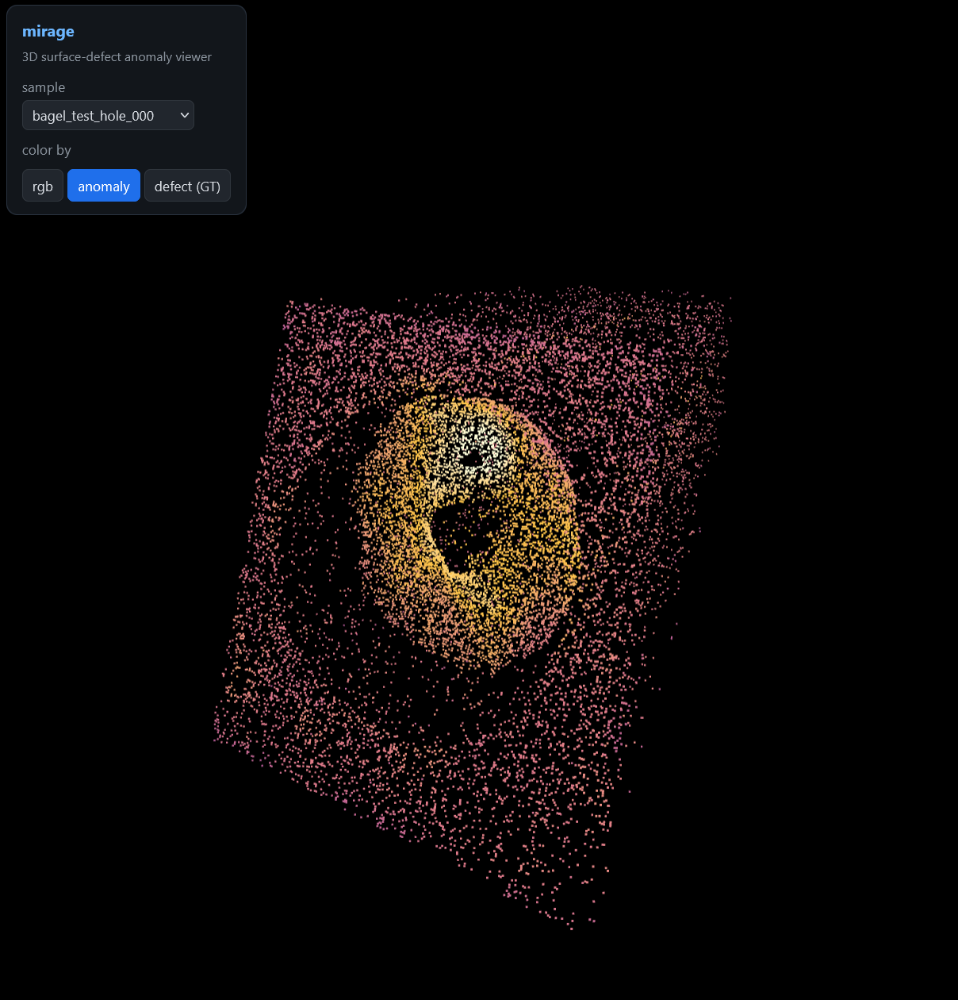

# mirage — 3D surface-defect anomaly detection with a measured sim-to-real gap

**Personal learning project.** Anomaly detection on 3D surface scans (MVTec 3D-AD), training only on
*good* examples — plus a synthetic-defect generator and a measured sim-to-real gap. Edge-deployable.

> Working name `mirage` (synthetic that must survive contact with the real). Repo folder may differ.



*The working detector (PatchCore feature memory bank) scoring a held-out bagel — bright = anomalous,
lit at the defect. Rotatable in-browser → [`pointcloud-viewer/`](pointcloud-viewer/). (Scan from
[MVTec 3D-AD](https://www.mvtec.com/company/research/datasets/mvtec-3d-ad), CC BY-NC-SA.)*

mirage detects **defects on 3D surface scans**, training only on *good* examples. Stage 0 stands up the
detector + an eval harness on **real** data and runs a like-for-like comparison of methods; Stage 1 adds
a **synthetic-defect generator** and measures the **sim-to-real gap**.

It's also how **I'm** ramping into 3D perception: built on public data, the data-engine + evaluation
discipline carried from prior acoustic-detection work, the 3D modality learned as I go. Full plan →
**[docs/PLAN.md](docs/PLAN.md)**.

## Stage 0 result — the measured investigation
Not a leaderboard number — the *measured contrast*. Per-category models, scored through one verified
eval harness (image-AUROC + pixel-AU-PRO). Full table + diagnostics → [`docs/RESULTS.md`](docs/RESULTS.md).

| method | paradigm | pixel AU-PRO |
|---|---|---|
| VAE / inpaint / DRAEM / fused (4+ variants) | reconstruct pixels → error | **0.095** (≈ random) |
| **PatchCore** (the deployable) | **memory bank** — nearest-neighbour to normal features, *no reconstruction* | **0.90** |
| feature-recon | reconstruct *features* → error | 0.91 |
| SOTA (multimodal fusion, *papers*) | RGB + 3D geometry fusion (M3DM 0.96 → DCRDF-Net 0.99) | ~0.96–0.99 |

**The finding:** pixel-reconstruction is ≈ random at localization — *measured* across four variants,
then *diagnosed*: raw-residual tracks geometric **complexity** (a curved rim is hard to rebuild), not
**defect-ness** (a smooth defect rebuilds fine → low residual). What works is **"compare to normal"** —
and two *different* paradigms get there: a **memory bank** (PatchCore: store normal features, score by
nearest-neighbour distance — no rebuilding at all) and **reconstruction moved into feature space**
(feature-recon). Both land ~0.90–0.91. The deployable is the memory bank. The gap to SOTA is named and
measured: multimodal RGB+3D fusion (M3DM through current DCRDF-Net ~0.99), not bank/resolution tuning —
what's worth showing is the eval rigor + the measured mechanism, not a single number.

## Stage 1 — measuring the sim-to-real gap
The easy demo trains on real defects and reports a flattering number. The question that matters: can a model
trained on **synthetic** defects detect **real** ones, *how much does it lose*, and is it **calibrated**
under that shift? Stage 1 measures it with a **triad** — one segmenter, three label sources, one shared
real eval half, bootstrap CIs from a single deterministic run:

| arm | AU-PRO [95% CI] | ECE |
|---|---|---|
| real → real (ceiling) | 0.794 [0.772, 0.813] | 0.010 |
| synth → real (**the gap**) | 0.628 [0.604, 0.650] | 0.075 |
| synth + DA → real (AdaBN) | 0.643 [0.618, 0.669] | 0.076 |

**Sim-to-real gap = 0.166 AU-PRO [0.141, 0.190]** (paired bootstrap, clears 0 — a real gap). Domain
adaptation (AdaBN) adds only **+0.015 [−0.000, 0.030]** — not significant, and doesn't restore calibration:
a reported negative, kept. The lever that *did* move the number was **not overtraining on synthetic**
(early-stopping on a held-out synth val lifted synth→real 0.54 → 0.63). Full method + diagnosis →
[`docs/RESULTS.md`](docs/RESULTS.md).

Sim-to-real for 3D anomaly is only now being charted ([SiM3D](https://arxiv.org/abs/2506.21549), 2025 — the
first synthetic→real benchmark, single-instance CAD→real). What's still open — a physics-based generator
that shrinks the gap **at the source**, and a closed-loop curriculum — is what comes next.

## Limits (measured, not assumed)
Edge-deployable and honestly benchmarked — **not** a production system. The gaps, measured rather than assumed:
- **Sim-to-real gap is real and open (0.166 AU-PRO).** Domain adaptation doesn't significantly close it
  (see [Stage 1](#stage-1--measuring-the-sim-to-real-gap)); shrinking it at the source (a better generator)
  is what comes next.
- **PatchCore is rgb-only + random coreset.** The ~3-pt gap to SOTA (~0.96) is **3D-feature fusion** (M3DM) +
  greedy coreset — named and measured, not bank or resolution tuning (rgb tops out ~0.93).
- **Our BTF underperforms paper-BTF** (0.65 vs ~0.96): FPFH runs on the 256-resized / grazing-noisy processed
  cloud, not native-resolution clean point clouds. A preprocessing limit, diagnosed, not a method failure.
- **3D is a ramp.** The data-engine + eval discipline carry from prior work; the 3D-perception specifics are
  the genuinely new skill, learned as I go.
- **Not a device.** Public research data only; edge deploy is real (ONNX), production-scale serving is not claimed.

## Data
**MVTec 3D-AD** (Bergmann et al., VISAPP 2022) — real industrial 3D anomaly benchmark, 10 categories
scanned with a Zivid structured-light sensor (per-pixel rgb + xyz position map + defect masks). Lives
**outside the repo** (licensing + size): set one root in `paths.yaml`, drop the download under
`<root>/raw/mvtec_3d_anomaly_detection/`. CC BY-NC-SA 4.0 — non-commercial, attribution required; not
redistributed here.

## Layout
`core/` (reusable engine) + `surfscan/` (the ML science) + `sim/` (the synthetic engine, own env):
```
core/                  the reusable, method-agnostic engine
  config.py            data root from paths.yaml (-> raw/ + processed/ + synth/)
  data/                adapters (mvtec · synth) + preprocess + unified store
  method.py            the (fit_fn, score_fn) contract the harness scores
surfscan/              the science layer
  models/              vae · inpaint · draem · feat_recon · patchcore · fpfh_bank (BTF)
  training/            train spine + hparams + losses
  experiments/         run_* — per-method benchmark runners (produce the AU-PRO board)
  evaluation/          harness (spine) · metrics · scoring · diagnostics · sync_numbers
  visualization/       show.py (3D viewer) + export_web.py (web-viewer data)
sim/                   synthetic-defect engine — Isaac/Replicator (its own env)
docs/                  PLAN.md · RESULTS.md (+ RESULTS.json canonical) · STRUCTURE.md
learning/ research/ tests/ (unit + integration) · pointcloud-viewer/
```

## Quickstart
```bash
uv sync --extra features          # .venv + deps; torch/torchvision cu130 (Blackwell/RTX 5090) auto-resolved
cp paths.example.yaml paths.yaml          # set `data:` to your data root
uv run python -m core.data.store        # consolidate raw -> processed (needs the dataset)

# the working detector, scored through the eval harness (logs params/metrics to MLflow):
uv run python -m surfscan.run patchcore   # image-AUROC + AU-PRO + per-defect, all 10 categories
uv run mlflow ui --backend-store-uri sqlite:///mlflow.db   # compare every method run in the browser

# see it: the defect glows under the working detector (vs the VAE's backwards residual):
uv run python -m surfscan.viz show --cat bagel --split test --defect hole --idx 0 --processed --patchcore
```
Experiment tracking is **MLflow** (canonical store: `mlflow.db` + `mlartifacts/`, gitignored) — every
method/training run logs params, metrics (per-category + per-defect), the aggregate, and trained models.

## Tests
```bash
uv run pytest tests/ -q        # unit (equivalence-class) + integration (module pairs)
```
Two layers: a wide **unit** base (partition each input space, one representative per class + boundaries) and
an **integration** layer over module pairs (A's output is a valid B input). `tests/unit/` **mirrors the
source tree** — enforced by the arch-fitness gate — so a module's tests live where the module does.

## Quality gates
The static-analysis gates — style/bugs, dead code, import layering, architecture fitness, module shape,
duplication — run in one command locally and identically in CI:
```bash
uvx nox -s lint        # ruff · vulture · import-linter · graph --assert · ast-grep · jscpd
```
(tests are the section above; CI runs both.) Their config, `devtools/`, and the nox/CI/pre-commit runners
are provisioned by an in-house copier template
([sdlc-scaffold](https://github.com/dimiturtrz/sdlc-scaffold)) — refresh with `uvx copier update` (version
pinned in `.copier-answers.yml`). Template-owned: fix a gate upstream, don't hand-edit it to pass.

## How it's built
Agent-driven build, human-owned judgment — the modeling, measurement correctness, and evaluation are
mine; coding agents scaffold the plumbing. Data-structure reasoning and evaluation discipline carry over
from prior ML work; the 3D specifics I learn as I go ([`learning/`](learning/)).

## References
- **MVTec 3D-AD** — Bergmann et al., *The MVTec 3D-AD Dataset for Unsupervised 3D Anomaly Detection and
  Localization*, VISAPP 2022.
- **PatchCore** — Roth et al., *Towards Total Recall in Industrial Anomaly Detection*, CVPR 2022.
- **DRAEM** — Zavrtanik et al., *DRÆM — A Discriminatively Trained Reconstruction Embedding for Surface
  Anomaly Detection*, ICCV 2021.
- **Reverse Distillation (RD4AD)** — Deng & Li, *Anomaly Detection via Reverse Distillation from One-Class
  Embedding*, CVPR 2022. (Basis for feature-recon.)
- **BTF** — Horwitz & Hoshen, *Back to the Feature: Classical 3D Features are (Almost) All You Need for 3D
  Anomaly Detection*, CVPR-W (VAND) 2023.
- **M3DM** — Wang et al., *Multimodal Industrial Anomaly Detection via Hybrid Fusion*, CVPR 2023.
- **DCRDF-Net** (current SOTA) — Wang, Chen & Zhang, *A Dual-Channel Reverse-Distillation Fusion Network for
  3D Industrial Anomaly Detection*, Sensors 26(2):412, 2026 ([doi:10.3390/s26020412](https://doi.org/10.3390/s26020412)).
- **SiM3D** — the first synthetic→real 3D-anomaly benchmark (single-instance, CAD→real),
  [arXiv:2506.21549](https://arxiv.org/abs/2506.21549), 2025.

## License
Code: see [LICENSE](LICENSE). The dataset is **not** included and carries its own license
(CC BY-NC-SA 4.0) — obtain it from [MVTec](https://www.mvtec.com/company/research/datasets/mvtec-3d-ad).
